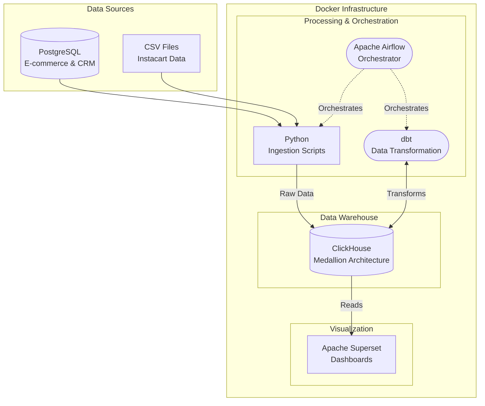
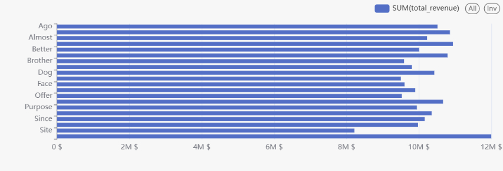
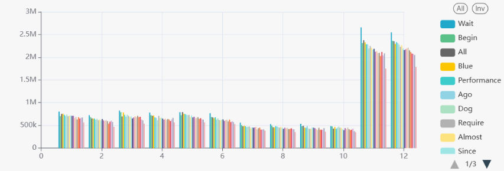

# Instacart Sales Data Warehouse 🛒📊


This is a Data Engineering project that builds a complete Data Warehouse system to analyze Instacart sales data. The system utilizes the Medallion Architecture (Bronze - Silver - Gold) to process data from raw format to business reporting.

<!-- System Architecture Diagram -->



## 🚀 Tech Stack

- **Orchestration**: Apache Airflow
- **Data Transformation**: dbt (Data Build Tool)
- **Data Warehouse**: ClickHouse (Powerful for OLAP)
- **Database Backend & Source**: PostgreSQL (Simulating E-commerce & CRM source data)
- **Data Visualization**: Apache Superset
- **Infrastructure**: Docker & Docker Compose

## 🏗 Data Architecture (Medallion)

```mermaid
flowchart LR
    subgraph Sources [Data Sources]
        PG[(Postgres)]
        CSV[CSV Files]
    end

    subgraph Bronze [Bronze Layer 🥉 <br> Raw Data]
        B1[(Raw E-commerce)]
        B2[(Raw Instacart)]
    end

    subgraph Silver [Silver Layer 🥈 <br> Conformed Data]
        S1[(Cleaned & Standardized)]
        S2[(Joined Dimensions)]
    end

    subgraph Gold [Gold Layer 🥇 <br> Aggregated Data]
        G1[(Sales Mart)]
        G2[(Customer Segments)]
    end

    Sources -->|Ingestion Scripts| Bronze
    Bronze -->|dbt clean| Silver
    Silver -->|dbt aggregate| Gold
    Gold -->|Query| BI[Apache Superset]

    classDef bronze fill:#cd7f32,stroke:#333,color:#fff
    classDef silver fill:#e0e0e0,stroke:#333
    classDef gold fill:#ffd700,stroke:#333

    class Bronze bronze
    class Silver silver
    class Gold gold
```

<!-- Medallion Architecture Diagram -->



1. **Bronze Layer (Raw Data)** 🥉
   - Stores raw data ingested from CSV (Instacart data) and PostgreSQL (E-commerce/CRM data).
   - ClickHouse tables use `MergeTree` with append-only data to retain history.
2. **Silver Layer (Conformed & Cleansed Data)** 🥈
   - Data is cleansed, data types are standardized, and null values are handled.
   - Tables are joined together to form preliminary dimension/fact tables.
3. **Gold Layer (Reporting / Aggregated Data)** 🥇
   - Data is aggregated according to specific business logic for dashboards on Superset.
   - Focuses on read query optimization (Read-heavy).

## 📂 Directory Structure

```text
Instacart_Sales_Data_Warehouse/
├── airflow/                    # Contains source code for Airflow (DAGs, plugins, logs)
│   └── dags/                   # Contains ETL/ELT pipelines (e.g., elt_pipeline.py)
├── dbt_instacart/              # dbt project (models for Bronze, Silver, Gold layers)
├── ingestion/                  # Python scripts handling data ingestion from source to Data Warehouse
├── postgres_init/              # PostgreSQL database initialization scripts
├── raw_data/                   # Generate raw data into Postgres
├── docker-compose.yaml         # Container configuration for Postgres, ClickHouse, Superset
├── docker-compose.airflow.yaml # Separate container configuration for Airflow
└── README.md                   # Project documentation
```

## 🛠 Installation & Setup Guide

### System Requirements:

- [Docker](https://docs.docker.com/get-docker/) & [Docker Compose](https://docs.docker.com/compose/install/)
- Available ports: 5432, 5433 (Postgres), 8123, 9000 (ClickHouse), 8088 (Superset), 8080 (Airflow).

### Setup Steps:

1. **Clone repository:**

   ```bash
   git clone https://github.com/buiphu2003/Instacart-Data-Warehouse.git
   cd Instacart_Sales_Data_Warehouse
   ```

2. **Start Data Warehouse & BI (ClickHouse, Postgres, Superset):**

   ```bash
   docker-compose up -d
   ```

3. **Start Airflow:**
   _(Airflow is run on a separate compose file with Postgres 13)_

   ```bash
   docker-compose -f docker-compose.airflow.yaml up -d
   ```

4. **Access the services:**
   - **Airflow Web UI**: `http://localhost:8080` (Default User/Pass configured in .env or compose file)
   - **Superset**: `http://localhost:8088` (User: admin / Pass: admin)
   - **ClickHouse HTTP**: `http://localhost:8123`

<!-- Superset Dashboards & Charts -->




## 📊 Roadmap / Future Work

- [ ] Complete automated Ingestion scripts to move data into ClickHouse.
- [ ] Run historical data backfill for all years.
- [ ] Build 3 main Dashboards on Superset (Sales Overview, Customer Segmentation, Product Performance).
- [ ] Integrate CI/CD (GitHub Actions) to automatically test dbt models.
